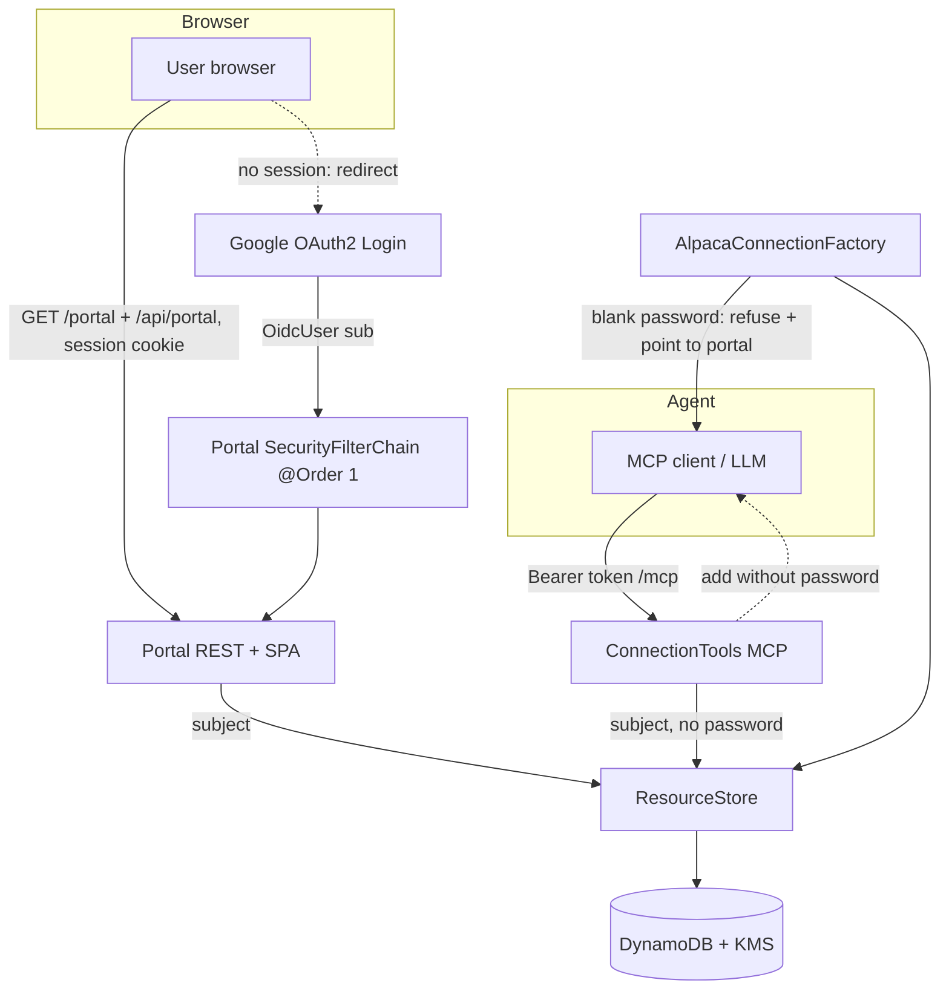

# Requirements

### Overview & Goals

Eliminate the need to hand BroadWorks passwords to the LLM/MCP agent. Introduce a browser-based **web portal** (secured by the same Google OAuth2 login already wired into the server) where an authenticated user manages their BroadWorks connections and — crucially — sets/updates the **password** out-of-band from the AI agent.

When the MCP agent creates a new connection, the server stores everything **except** the password and tells the agent to direct the user to the web portal to supply it.

### Scope

**In Scope**
- An Angular single-page app (latest LTS), built and bundled same-origin, served at `/portal/**` and gated by Google `oauth2Login` (browser session), talking to a JSON REST API under `/api/portal/**`.
- Full CRUD in the portal: create a connection, edit its non-secret fields, set/update its password, and delete it.
- Change the MCP `broadworks_add_connection` tool so it **no longer accepts or requests a password**; the stored connection starts with an empty password.
- Surface a "needs password" state to the MCP agent (in list output and when a passwordless connection is used) with a message pointing the user to the portal.
- Reuse existing per-tenant isolation (`subject`), encrypted-at-rest storage (`ResourceStore` + KMS), and SSRF host-allowlist screening.

**Out of Scope**
- Any change to the MCP authorization-code / Dynamic Client Registration flows.
- Schema/table changes for the passwordless state (the empty-password value is reused — see Technical Design).
- New identity providers; Google remains the sole IdP.
- Multi-user sharing of a connection (connections stay owned by a single `subject`).

### User Stories
- As an authenticated user, I want to sign in to a web portal with my Google account so that I can manage my BroadWorks credentials without exposing them to the AI agent.
- As a user, I want to see all my BroadWorks connections and which ones are missing a password so that I know which need attention.
- As a user, I want to set or update a connection's password in the portal so that the AI agent can then use that connection.
- As a user, I want to create, edit, and delete connections in the portal so that I can fully manage them in one place.
- As an AI-agent user, when I ask the agent to add a BroadWorks connection, I want the agent to store the connection and tell me to finish it in the portal, so that no password is ever typed into the chat.

### Functional Requirements
- The portal requires an authenticated Google session; unauthenticated browser requests to `/portal/**` redirect to Google login and return to the portal afterward.
- The portal only ever shows and mutates connections owned by the logged-in user's `subject` (the same key MCP tools use), so connections created via MCP appear in the portal and vice-versa.
- `broadworks_add_connection` accepts display name, hostname, port, username, login type, private-AS flag, and optional resource id — **but not a password** — and returns a summary indicating the connection needs a password set in the portal.
- A connection with a blank password is treated as **not usable**: MCP `broadworks_list_connections` marks it `needsPassword=true`, and any attempt to actually connect fails fast with a clear message telling the user to set the password in the web portal.
- Passwords are never rendered back to the browser (edit form shows a blank password field), never returned by MCP, and never logged.

### Non-Functional Requirements
- **Security**: portal REST POSTs are CSRF-protected via `CookieCsrfTokenRepository` (Angular's `HttpClient` echoes the `XSRF-TOKEN` cookie as the `X-XSRF-TOKEN` header); passwords stay encrypted at rest via the existing `EncryptionService`; SSRF allowlist (`HostAllowlist`) is enforced on portal-supplied hostnames exactly as in the MCP tool.
- **Compatibility**: no change to the MCP transport (`STATELESS /mcp`) or the Authorization-Server / Resource-Server chains; the portal is additive.
- **Statelessness**: portal sessions use the existing Spring Session (DynamoDB) so they work across the load-balanced ECS tasks.

# Technical Design

### Current Implementation

- **Stack**: Spring Boot `4.1.0`, Java 21, Spring AI MCP server (`spring-ai-starter-mcp-server-webmvc`, `STATELESS` transport at `/mcp`). No frontend today — no SPA, no `static/`, no build tooling.
- **Triple OAuth role**:
  - `AuthorizationServerConfig` (`@Order(HIGHEST_PRECEDENCE)`) — Spring Authorization Server for MCP clients; unauthenticated `text/html` hits on the authorize endpoint already redirect to `/oauth2/authorization/google`.
  - `SecurityConfig#appSecurityFilterChain` (`@Order(2)`, `securityMatcher("/**")`) — Resource Server (opaque bearer via `StoreOpaqueTokenIntrospector`) **and** interactive `oauth2Login` with Google (rejects unverified emails). Its `authenticationEntryPoint` is `BearerChallengeEntryPoint` (returns a 401 bearer challenge for *all* unauthenticated requests, including browser ones).
- **Identity alignment**: browser `oauth2Login` yields an `OidcUser` whose `sub` attribute is the Google subject; MCP bearer introspection (`StoreOpaqueTokenIntrospector`, line 55) exposes the same `sub` from the stored `Session`. `UserContext.current()` reads `sub` uniformly for both. **Therefore a portal user and the MCP agent resolve to the same `subject`, and see the same connections.**
- **Credential store**: `AlpacaResource` record (resourceId, displayName, hostname, port, loginType, username, password, usePrivateApplicationServerAddress) persisted per `subject` by `ResourceStore` — `DynamoDbResourceStore` (KMS-encrypted `password`) or `InMemoryResourceStore`. Password is a plaintext value at the Java boundary; encryption is internal to the store.
- **MCP tools**: `ConnectionTools` exposes `broadworks_add_connection` (currently **requires** a password, lines 76 & 106–108), `broadworks_list_connections`, `broadworks_delete_connection`. `ConnectionSummary.from(...)` deliberately drops the password.
- **Connection use**: `CachingAlpacaConnectionFactory#connect(subject, resourceId)` resolves the `AlpacaResource` via `resolveResource(...)` then logs in (`LiveAlpacaConnectionFactory#login` calls `server.connect(config)` with the credentials).

### Key Decisions
1. **Angular SPA, bundled same-origin** (confirmed). An Angular app (latest LTS) is built during the Maven build via `frontend-maven-plugin` (downloads a pinned Node/npm) into `target/classes/static/portal`, so Spring Boot serves it same-origin. No JS server, no CORS, and no Dockerfile/deploy changes.
2. **Session-cookie (BFF) auth** (confirmed). The SPA reuses the existing `oauth2Login` server session; REST calls ride the session cookie, with `CookieCsrfTokenRepository` for CSRF. No OAuth tokens ever live in the browser.
3. **Dedicated portal `SecurityFilterChain`** ordered *before* the app chain, matching `/portal/**` and `/api/portal/**`. It uses `oauth2Login` + session; a `DelegatingAuthenticationEntryPoint` redirects `text/html` navigations to Google login (SPA shell) but returns `401` for XHR/JSON API calls, so the app-chain bearer 401 never applies here.
4. **Passwordless state derived from a blank password** (confirmed). No schema/model field is added: an empty/blank `AlpacaResource.password()` means "needs password". `ConnectionSummary` gains a computed `needsPassword` boolean; the connection factory refuses to log in a blank-password resource with a portal-pointing message.
5. **Full CRUD in the portal** (confirmed), reusing the exact validation + `HostAllowlist` SSRF checks already in `ConnectionTools` (extracted so both call sites share them).

### Proposed Changes

**MCP tool — stop collecting passwords** (`ConnectionTools`)
- Remove the `password` `@ToolParam` from `broadworks_add_connection` and the `password` required-check.
- Build the `AlpacaResource` with an **empty** password; update the tool description and the returned summary so the agent tells the user to open the web portal to set the password.
- `broadworks_list_connections` returns summaries with `needsPassword` so the agent can report which connections are incomplete.

**Passwordless guard** (`CachingAlpacaConnectionFactory`)
- In `connect(...)` / `resolveResource(...)`, if the resolved resource's password is blank, throw `AlpacaException` with a clear, secret-free message: e.g. *"This BroadWorks connection has no password yet — set it in the web portal before using it."*

**Summary model** (`ConnectionSummary`)
- Add a `needsPassword` field, computed in `from(AlpacaResource)` as `password == null || password.isBlank()`.

**Portal security** (new `PortalSecurityConfig`)
- `@Bean @Order(1)` `SecurityFilterChain` with `securityMatcher("/portal/**", "/api/portal/**")`:
  - `authorizeHttpRequests` → `anyRequest().authenticated()`.
  - `.oauth2Login(...)` reusing the existing `oidcUserService()` (rejecting unverified emails).
  - CSRF via `CookieCsrfTokenRepository.withHttpOnlyFalse()` so the Angular client can read the `XSRF-TOKEN` cookie and echo it as `X-XSRF-TOKEN`.
  - `exceptionHandling` with a `DelegatingAuthenticationEntryPoint`: `text/html` requests → `LoginUrlAuthenticationEntryPoint("/oauth2/authorization/google")`; everything else (XHR/JSON) → `HttpStatusEntryPoint(UNAUTHORIZED)`.
- The existing public paths (`/login/**`, `/oauth2/authorization/**`, `/login/oauth2/code/**`) already permit the login handshake.

**Portal web layer** (new package `web.portal`)
- `PortalConnectionController` (`@RestController`, base path `/api/portal/connections`) returning JSON:
  - `GET /api/portal/connections` — list the user's connections (each with `needsPassword`).
  - `GET /api/portal/connections/{id}` — fetch one (no password).
  - `POST /api/portal/connections` — create (non-secret fields; optional password).
  - `PUT /api/portal/connections/{id}` — update non-secret fields (blank/absent password leaves the secret unchanged).
  - `PUT /api/portal/connections/{id}/password` — set/update password only.
  - `DELETE /api/portal/connections/{id}` — delete.
  - All handlers derive `subject` from `UserContext.current()` and call `ResourceStore`.
- `PortalSpaController` (`@Controller`) forwards `/portal` and `/portal/**` deep links to the bundled `index.html` so client-side routing survives refresh.
- DTOs as records with Bean Validation: `ConnectionRequest` (`@NotBlank` host/displayName, `@Min/@Max` port, optional password), `PasswordRequest` (`@NotBlank` password), and `ConnectionResponse` (never carries a password).
- Shared validation/SSRF: extract the host/port/allowlist checks from `ConnectionTools` into a small reusable helper (e.g. `ConnectionValidation`) used by both the MCP tool and the portal controller.

**Angular app** (`src/main/frontend/`)
- Angular workspace (latest LTS) built with base href `/portal/`, an `HttpClient`-based `ConnectionsService`, a list view (with a `needsPassword` badge), a create/edit form, and a set-password form. Angular's `HttpClientXsrfModule`/`withXsrfConfiguration` echoes the CSRF cookie. Stored passwords are never fetched or rendered.

**Build** (`pom.xml`)
- Add `frontend-maven-plugin` (pinned Node/npm) bound to `generate-resources` to `npm ci` and `npm run build` the Angular app straight into `target/classes/static/portal`.

### Data Models / Contracts
```java
// ConnectionSummary (add needsPassword)
public record ConnectionSummary(String resourceId, String displayName, String hostname,
        int port, String loginType, String username,
        boolean usePrivateApplicationServerAddress, boolean needsPassword) { ... }

// broadworks_add_connection (no password param)
ConnectionSummary addConnection(String displayName, String hostname, int port,
        String username, String loginType,
        Boolean usePrivateApplicationServerAddress, String resourceId);

// Portal REST DTOs
record ConnectionRequest(@NotBlank String displayName, @NotBlank String hostname,
        @Min(1) @Max(65535) int port, @NotBlank String username, String loginType,
        boolean usePrivateApplicationServerAddress, String password /* optional on create/update */) {}
record PasswordRequest(@NotBlank String password) {}
record ConnectionResponse(String resourceId, String displayName, String hostname, int port,
        String loginType, String username, boolean usePrivateApplicationServerAddress,
        boolean needsPassword) {} // never carries a password
```

### File Structure
```
src/main/java/co/pitayagroup/mcp/broadworks/
  config/PortalSecurityConfig.java            (new) portal SecurityFilterChain @Order(1)
  web/portal/PortalConnectionController.java   (new) @RestController JSON CRUD
  web/portal/PortalSpaController.java          (new) forward /portal/** deep links to index.html
  web/portal/dto/ConnectionRequest.java        (new) validated create/update DTO
  web/portal/dto/PasswordRequest.java          (new) validated password DTO
  web/portal/dto/ConnectionResponse.java       (new) JSON response DTO (no password)
  mcp/tools/ConnectionValidation.java          (new) shared host/port/SSRF checks
  mcp/tools/ConnectionTools.java               (modify) drop password param + guidance msg
  mcp/model/ConnectionSummary.java             (modify) add needsPassword
  mcp/CachingAlpacaConnectionFactory.java      (modify) blank-password guard
src/main/frontend/                             (new) Angular workspace (app, service, components)
pom.xml                                        (modify) add frontend-maven-plugin
```

### Architecture Diagram


### Risks
- **`oauth2Login` shared with the SAS authorization-code flow**: adding `defaultSuccessUrl("/portal")` must not hijack the MCP client login. Mitigation: rely on Spring Security's saved-request behavior (the SAS `/oauth2/authorize` request is restored after login; `defaultSuccessUrl` only applies when there is no saved request) — verified against `AuthorizationServerConfig`.
- **Filter-chain ordering**: the portal chain must be `@Order(1)` (between SAS `HIGHEST_PRECEDENCE` and the app chain `@Order(2)`) with a `/portal/**` matcher so it doesn't shadow `/mcp` or the bearer chain.
- **Blank-password edit semantics**: an empty password field on the edit form must mean "leave unchanged", not "clear the password"; a dedicated set-password action avoids accidental wipes.
- **Unverified-email rejection** must apply to the portal chain too (reuse the existing `oidcUserService` logic).

# Testing

### Validation Approach
Use Spring Boot slice/integration tests following the existing conventions (`@WebMvcTest`, `@SpringBootTest`, `spring-security-test`, `InMemoryResourceStore`). Verify each functional requirement: passwordless MCP add, portal auth gating, portal CRUD, and the passwordless guard. Confirm the build/tests pass with `./mvnw test` (or `mvn test`).

### Key Scenarios
- **MCP add without password**: calling `broadworks_add_connection` (no password arg) stores a resource with a blank password and returns a summary with `needsPassword=true` and portal guidance text. (extend `ConnectionToolsTest`).
- **MCP list**: `broadworks_list_connections` reports `needsPassword` correctly for blank vs set passwords.
- **Passwordless guard**: `CachingAlpacaConnectionFactory#connect` throws `AlpacaException` with the portal-pointing message when the resource password is blank; succeeds once a password is present (extend `CachingAlpacaConnectionFactoryTest`).
- **Portal auth gating**: an unauthenticated `text/html` `GET /portal` redirects to `/oauth2/authorization/google`, while an unauthenticated JSON `GET /api/portal/connections` returns `401`; an authenticated `oidcLogin()` request returns the JSON list.
- **Portal CRUD**: with a mocked/authenticated OIDC user, `POST`/`PUT`/`DELETE` on `/api/portal/connections` mutate the `ResourceStore` for that `subject` only; a blank/absent password on update leaves the secret unchanged; the set-password endpoint updates it.
- **Cross-surface identity**: a connection created via MCP for a `subject` is visible in the portal for the same `subject` (shared `ResourceStore`).

### Edge Cases
- Invalid form input (blank host, out-of-range port) returns the form with validation errors and does not persist.
- SSRF-blocked hostname from the portal is rejected with the same uniform message as the MCP tool.
- Tenant isolation: user A cannot see or mutate user B's connection ids (attempting to edit an id not owned by the subject yields not-found / no-op).
- Passwords are never present in REST responses, MCP responses, or logs.

### Test Changes
- Update `ConnectionToolsTest` for the new (password-less) `addConnection` signature and `needsPassword` output.
- Update `CachingAlpacaConnectionFactoryTest` for the blank-password guard.
- Add `PortalConnectionControllerTest` (`@WebMvcTest` + `spring-security-test` `oidcLogin()`), covering JSON CRUD, tenant isolation, validation errors, and that passwords never appear in responses.
- Add a `SecurityFilterChain` ordering/behavior assertion: `/portal/**` (text/html) redirects to Google while `/api/portal/**` (JSON) returns `401`, and neither shadows `/mcp` or the bearer chain.

# Delivery Steps

### ✓ Step 1: Add passwordless-connection model and connection guard
A BroadWorks connection with a blank password is a first-class, clearly-surfaced 'needs password' state that cannot be used until a password is set.

- Add a computed `needsPassword` field to `mcp/model/ConnectionSummary.java`, set in `from(AlpacaResource)` as `password == null || password.isBlank()`.
- In `mcp/CachingAlpacaConnectionFactory.java` (`connect`/`resolveResource`), throw `AlpacaException` with a secret-free, portal-pointing message when the resolved resource has a blank password, before attempting login.
- Update `CachingAlpacaConnectionFactoryTest` to assert the guard fires on blank password and that a set password still connects.

### ✓ Step 2: Make broadworks_add_connection stop collecting passwords
The MCP agent can add a connection without ever handling a password and is told to send the user to the web portal to finish it.

- In `mcp/tools/ConnectionTools.java`, remove the `password` `@ToolParam` and its required-check from `broadworks_add_connection`; build the `AlpacaResource` with an empty password.
- Update the tool description and returned `ConnectionSummary` guidance so the agent instructs the user to open the web portal to set the password.
- Extract the host/port/`HostAllowlist` SSRF validation into a shared `mcp/tools/ConnectionValidation.java` helper reused here and by the portal.
- Ensure `broadworks_list_connections` surfaces `needsPassword`.
- Update `ConnectionToolsTest` for the new signature and `needsPassword` output.

### ✓ Step 3: Add the portal security chain and Angular build tooling
Browser navigations to `/portal/**` are gated by Google OAuth2 login with a session (redirecting to Google), while `/api/portal/**` JSON calls return 401 when unauthenticated; the Angular app is bundled same-origin by the Maven build.

- Add `frontend-maven-plugin` to `pom.xml` (pinned Node/npm) bound to `generate-resources`, running `npm ci` then `npm run build` to emit into `target/classes/static/portal`.
- Scaffold the Angular workspace under `src/main/frontend/` (latest LTS) with base href `/portal/` and an `npm run build` script that outputs to the Maven-consumed directory.
- Add `config/PortalSecurityConfig.java` with a `@Bean @Order(1)` `SecurityFilterChain` using `securityMatcher("/portal/**", "/api/portal/**")`, `anyRequest().authenticated()`, `oauth2Login` reusing the unverified-email-rejecting `oidcUserService`, `CookieCsrfTokenRepository.withHttpOnlyFalse()`, and a `DelegatingAuthenticationEntryPoint` (text/html → Google login; else 401).
- Rely on saved-request behavior so the existing MCP authorization-code login flow is unaffected.
- Add a test asserting `/portal/**` (text/html) redirects to Google while `/api/portal/**` (JSON) returns 401, and neither shadows `/mcp` or the bearer chain.

### ✓ Step 4: Build the portal CRUD REST backend and Angular UI
Authenticated users get a working web portal to view, create, edit, set-password, and delete their BroadWorks connections.

- Add `web/portal/PortalConnectionController.java` (`@RestController`, `/api/portal/connections`) with JSON handlers: `GET` (list with `needsPassword`), `GET /{id}`, `POST` (create), `PUT /{id}` (update non-secret; blank/absent password unchanged), `PUT /{id}/password` (set password), `DELETE /{id}`.
- Add `web/portal/PortalSpaController.java` (`@Controller`) forwarding `/portal` and `/portal/**` deep links to the bundled `index.html`.
- Derive `subject` from `UserContext.current()` and operate only on that tenant's `ResourceStore` entries; reuse `ConnectionValidation` for host/port/SSRF checks.
- Add validated DTO records `web/portal/dto/ConnectionRequest.java`, `PasswordRequest.java`, and `ConnectionResponse.java` (no password), bound via `@Valid`.
- Build the Angular UI in `src/main/frontend/`: a `ConnectionsService` (`HttpClient`, XSRF), a list component (needs-password badge, actions), a create/edit form component, and a set-password component; never fetch or render stored passwords.
- Add `PortalConnectionControllerTest` (`@WebMvcTest` + `spring-security-test` `oidcLogin()`) covering auth, CRUD, tenant isolation, validation errors, and that passwords never appear in responses.