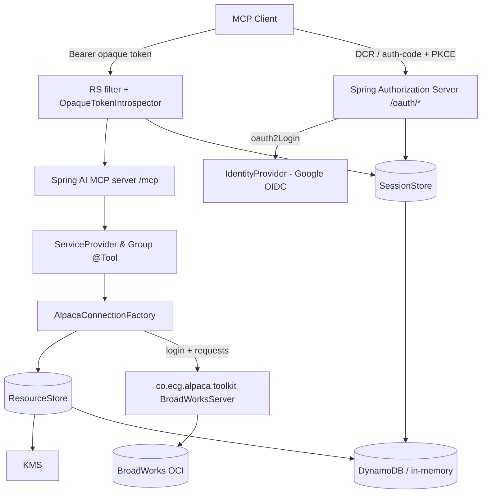

# Requirements

### Overview & Goals
Build `broadworks-mcp`: a production-ready **MCP (Model Context Protocol) server** that exposes BroadWorks operations to MCP clients (LLM agents, desktop apps). It is a **single Spring Boot 3.x / Java 21** application built with **Maven**, using **Spring AI MCP** for the server transport and calling the **Alpaca toolkit** (`co.ecg.alpaca.toolkit`) directly as the sole BroadWorks interface. It is deployed on **AWS (ECS Fargate + ALB/HTTPS)** with infrastructure defined in **AWS CDK (TypeScript)**.

The server is simultaneously an **OAuth 2.1 Authorization Server (AS)** fronting **Google OIDC** and a **Resource Server (RS)** guarding MCP tool calls, with pluggable **DynamoDB (durable) + in-memory (fallback)** storage.

### Key Confirmed Decisions
- **Alpaca interface**: MCP tools call the pure `co.ecg.alpaca.toolkit` library (`BroadWorksServer` + generated `User`/`Group`/`ServiceProvider`/`Enterprise` request objects). The toolkit JARs (`alpaca-library` + `alpaca-core`/`alpaca-model`) will be supplied under `lib/`. **No** separate `BroadWorksClient` facade.
- **Runtime**: Single Spring Boot 3.x + Java 21 app + Spring AI MCP, depending only on the framework-agnostic toolkit (the supplied `alpaca-server.jar` is Boot 2.7/javax and is **not** placed on the classpath).
- **OAuth**: Implemented with **Spring Authorization Server**, customized to the blueprint's exact endpoint paths and **opaque (REFERENCE) tokens**.
- **AWS**: **ECS Fargate + ALB/HTTPS**; the Fargate **task IAM role** provides the KMS/DynamoDB access the blueprint calls "IRSA".
- **Initial MCP tools**: **Groups & Service Providers** (list/get), built on an extensible tool-registration pattern so User/Devices/CallCenters/CDR tools can be added later.

### Scope
**In Scope**
- Maven Spring Boot 3.x project with Spring AI MCP (Streamable HTTP/SSE `:8080` + stdio) and Alpaca toolkit wired in.
- Full generic Auth framework: `IdentityProvider` (Google default + test stub), OAuth AS + RS at the exact paths, opaque token lifecycle with configurable TTLs.
- Pluggable storage: `SessionStore` + `ResourceStore` with DynamoDB (+ customer-managed KMS) and in-memory implementations.
- Initial MCP tool set (Groups & Service Providers) calling the toolkit; extensible registration.
- AWS CDK (TypeScript) for Fargate/ALB/DynamoDB/KMS/SSM.
- README (env vars, JAR install, local run stdio+HTTP, auth flow) + unit/integration tests.

**Out of Scope**
- Running/embedding the full `alpaca-server` Boot 2.7 application.
- Non-Google IdP concrete implementations (interface only, pluggable later).
- MCP tools beyond Groups & Service Providers (framework makes them additive).
- Real BroadWorks/Google network calls in tests (always stubbed).

### User Stories
- As an **MCP client**, I make an unauthenticated call and receive **401 + `WWW-Authenticate: Bearer … resource_metadata=…`** so I can discover how to authenticate.
- As an **end user**, I complete Google sign-in via OAuth 2.1 authorization-code + **PKCE (S256)** and the server issues opaque access/refresh tokens tied to my IdP `sub`.
- As an **MCP client**, I call BroadWorks tools with `Authorization: Bearer <opaque token>` and get per-tenant results.
- As an **operator**, I configure everything via env/SSM (Google client id/secret, `PUBLIC_BASE_URL`, table names, TTLs, allow-lists, `APPLICATION_ID`) with no secrets in code.
- As a **developer**, I run locally over stdio (in-memory stores) and add new tools by writing a `@Tool` method.

### Functional Requirements
- OAuth endpoints at exactly: `GET /.well-known/oauth-protected-resource` (+ trailing slash), `GET /.well-known/oauth-authorization-server`, `POST /oauth/register`, `GET /oauth/authorize`, `GET /oauth/callback`, `POST /oauth/token` (grants `authorization_code`, `refresh_token`).
- MCP endpoints use Spring AI MCP defaults (rooted at `/mcp`) — no invented paths.
- Google ID-token verification (signature via JWKS, `aud`, `iss`, `exp`, `sub` present, `email_verified == true`) at callback **and** token issuance.
- PKCE S256 mandatory; auth codes one-time + 5 min; DCR public clients only (no client secrets), persisted 90 days.
- Tools obtain authenticated `UserInfo{subject,email}` from context, load the user's Alpaca config+secrets from `ResourceStore`, then call the toolkit.

### Non-Functional Requirements
- Strict per-tenant isolation: all state keyed by `subject` (never email); resources keyed `(applicationId, <subject>#<resourceID>)`.
- Secrets encrypted at rest (customer-managed KMS); **never log** tokens/passwords/bodies; redact `Authorization`/`Cookie`/`Proxy-Authorization`.
- Externalized config only; no magic numbers (all TTLs are named constants/config); constructor injection; Java records for value types.
- stdio logs to stderr only (stdout reserved for protocol).

# Technical Design

### Current Implementation
Greenfield project. The only asset is `lib/alpaca-server-12.2.0-RELEASE-26.jar` — a full **Spring Boot 2.7.13 / Java 17 / javax** application (`co.ecg.alpaca.server.*`, 1497 classes). Investigation showed the real BroadWorks API it drives is the separate **`co.ecg.alpaca.toolkit`** library (references: `model.BroadWorksServer` (1606 refs), generated `ServiceProvider`/`Group`/`User`/`Enterprise`, `messaging.request.Request`/`messaging.response.Response`, `task.BroadWorksProcess`, `exception.*`). The calling pattern is: obtain a `BroadWorksServer` via `login(...)`, then invoke generated request builders that return typed `Response` objects. That toolkit is what we depend on directly.

### Key Decisions
- **Depend on the pure toolkit, not alpaca-server**: keeps us on Boot 3.x/jakarta and avoids the Boot 2.7 conflict. `alpaca-server.jar` stays in `lib/` for reference only.
- **Alpaca Maven approach = `install:install-file` + normal `<dependency>`** (not `system` scope): install `alpaca-library`/`alpaca-core`/`alpaca-model` into the local repo so `spring-boot-maven-plugin repackage` and the Fargate image work. A `scripts/install-alpaca.sh` + README documents it; a Maven profile can auto-install from `lib/` on first build.
- **OAuth via Spring Authorization Server (SAS)**, customized to meet the blueprint: `AuthorizationServerSettings` overrides endpoint URIs to the exact paths; `TokenSettings.accessTokenFormat(OAuth2TokenFormat.REFERENCE)` yields **opaque** access tokens (refresh tokens are opaque by default); custom `RegisteredClientRepository` + `OAuth2AuthorizationService` are backed by our pluggable stores; RFC 7591 DCR at `/oauth/register` restricted to public clients.
- **Friction noted (blueprint `IdentityProvider` vs SAS)**: SAS handles upstream login via Spring Security `oauth2Login()`. We still expose the blueprint's `IdentityProvider` interface as the pluggable abstraction; the Google implementation delegates to Spring's OIDC/JWKS machinery and enforces `email_verified`, and a **stub** implementation (backed by a WireMock OIDC in tests) satisfies the "stubbed IdP" requirement. This reconciliation is the main design risk (see Risks).
- **RS uses local opaque introspection**: since AS+RS share a process, a custom `OpaqueTokenIntrospector` resolves the bearer token against the `OAuth2AuthorizationService`/`SessionStore` (no network introspection call) and injects `UserInfo`.
- **AWS IRSA → Fargate task role**: the CDK task role grants scoped KMS + DynamoDB access; SSM SecureString params hold Google client id/secret and `PUBLIC_BASE_URL`.
- **All TTLs are config constants** bound via `@ConfigurationProperties` records.

### Proposed Changes
**Transports**
- HTTP (default, `:8080`): `spring-ai-starter-mcp-server-webmvc` (Streamable HTTP/SSE) with full RS filter + all OAuth endpoints active. MCP rooted at Spring AI defaults (`/mcp`).
- stdio (`stdio` profile): `spring-ai-starter-mcp-server` with web server disabled; HTTP auth filter not applied, but tool handlers still require an authenticated `UserInfo` (supplied via configured local principal). Logs to stderr.

**Auth framework** (`…auth.*`)
- `identity`: `IdentityProvider` interface (`authCodeUrl`, `exchange`, `verifyIdToken`), `IdTokenClaims`/`RawTokens` records, `GoogleIdentityProvider`, `StubIdentityProvider` (test).
- `oauth`: `AuthorizationServerConfig` (SAS setup, custom paths, opaque token settings, DCR), `ProtectedResourceMetadataController` (RFC 9728 `/.well-known/oauth-protected-resource` + trailing slash), `BearerChallengeEntryPoint` (401 + `WWW-Authenticate`, HTML for browsers / plain otherwise).
- `session`: `Session` + `UserInfo` records, `UserContext`/`UserFromContext` helper, `OpaqueTokenFactory` (≥32 random bytes), `StoreBackedAuthorizationService` (SAS `OAuth2AuthorizationService` ↔ `SessionStore`), `StoreBackedRegisteredClientRepository`.
- `store`: `SessionStore` (`createSession`, `getSessionByAccessToken`, `getSessionByRefreshToken`, `deleteSession`, `saveClient`, `getClient`), `ResourceStore` (`listForUser`, `get`, `put`, `delete`), `EncryptionService` (KMS + noop), in-memory + DynamoDB implementations. Auth codes + pending auths stay **process-local**.

**MCP tools** (`…mcp.tools`)
- `AlpacaConnectionFactory`: thin helper that reads the caller's `AlpacaResource` (host/port/login type/credentials, decrypted) from `ResourceStore` keyed by `subject` and returns a logged-in `BroadWorksServer` (cached per `(subject,resourceID)`).
- `ServiceProviderTools` + `GroupTools`: `@Tool` methods (list/get service providers, list groups in a service provider, get group) mapping arguments to toolkit generated requests and returning DTO records. Registered via `MethodToolCallbackProvider` in `McpToolConfig` — adding a new `@Tool` bean auto-registers it.

**Config** (`…config`)
- `@ConfigurationProperties` records: `OidcProperties` (Google client id/secret), `AuthTokenProperties` (access 1h, refresh 30d, auth-code 5m, pending-auth 15m, client 90d), `StorageProperties` (backend, session/user-config tables, KMS key, region), `AlpacaProperties`, `PublicBaseUrlProperties`, `RedirectAllowlistProperties`, `ApplicationIdProperties`.
- `SecurityConfig` (RS filter chain, bearer + `oauth2Login` google), `AuthorizationServerConfig`, `AlpacaConfig`, `StorageConfig` (backend toggle), `McpToolConfig`.

### Data Models / Contracts
```java
public record UserInfo(String subject, String email) {}
public record IdTokenClaims(String sub, String email, boolean emailVerified, String iss, String aud, Instant exp) {}

public interface IdentityProvider {
    URI authCodeUrl(String state, String codeChallenge);
    ExchangeResult exchange(String code, String codeVerifier);      // (IdTokenClaims, RawTokens)
    IdTokenClaims verifyIdToken(String rawIdToken);                 // sig/aud/iss/exp/sub/email_verified
}

public interface SessionStore {
    Session createSession(Session s);
    Optional<Session> getSessionByAccessToken(String accessToken);
    Optional<Session> getSessionByRefreshToken(String refreshToken);
    void deleteSession(String sessionId);
    void saveClient(RegisteredClientRecord c);
    Optional<RegisteredClientRecord> getClient(String clientId);
}

public interface ResourceStore {
    List<AlpacaResource> listForUser(String subject);
    Optional<AlpacaResource> get(String subject, String resourceId);
    void put(String subject, AlpacaResource resource);
    void delete(String subject, String resourceId);
}
```
DynamoDB single-table for sessions: `pk` with `sess#`/`client#` prefixes + `type` attribute, GSI `refresh-index`. Resource table: partition `applicationId`, sort `<subject>#<resourceID>`, secret fields KMS-encrypted behind `EncryptionService`.

### File Structure
```
broadworks-mcp/
  pom.xml
  lib/ (alpaca toolkit jars + alpaca-server.jar reference)
  scripts/install-alpaca.sh
  src/main/java/com/broadworks/mcp/
    BroadWorksMcpApplication.java
    config/            (properties records + *Config)
    auth/identity/     (IdentityProvider, Google, Stub, records)
    auth/oauth/        (AuthorizationServerConfig, metadata controller, entrypoint)
    auth/session/      (Session, UserInfo, UserContext, token factory, SAS adapters)
    auth/store/        (SessionStore, ResourceStore, EncryptionService + inmemory/dynamodb impls)
    mcp/               (McpToolConfig, AlpacaConnectionFactory)
    mcp/tools/         (ServiceProviderTools, GroupTools)
  src/main/resources/ application.yml, application-stdio.yml
  src/test/java/...    (unit + auth-code/PKCE integration with WireMock stub IdP)
  cdk/                 (TypeScript CDK app: Fargate, ALB, DynamoDB, KMS, SSM)
  README.md
```

### Architecture Diagram


### Risks
- **SAS vs blueprint interface mismatch**: making SAS emit opaque tokens fronting Google while keeping the `IdentityProvider` abstraction and exact `/oauth/callback` path requires custom `AuthorizationServerSettings`, redirection endpoint remapping, and token-format config; mitigated by early integration test.
- **Toolkit transitive deps**: `alpaca-library` may pull JAXB/`javax.xml.bind` or old libs; mitigated by installing only required companions and adding `jakarta`/`jaxb` shims if needed.
- **stdio auth context**: no HTTP filter, so a local principal source must be defined for tools that still require `UserInfo`.
- **Opaque token introspection consistency** across replicas relies on DynamoDB (documented; in-memory is single-node only).

# Testing

### Validation Approach
Emphasize fast unit slices plus one full end-to-end auth flow against a **stubbed** IdP. No real Google or BroadWorks calls ever. Verify `./mvnw test` green and (locally) `/actuator/health` UP.

### Key Scenarios
- **Token lifecycle**: `OpaqueTokenFactory` produces ≥32 random bytes, unique; access/refresh/auth-code/pending TTLs come from config constants (assert defaults 1h / 30d / 5m / 15m / 90d); access token capped by IdP ID-token expiry.
- **Stores (both impls)**: `SessionStore` create/get-by-access/get-by-refresh/delete + save/get client; `ResourceStore` list/get/put/delete with per-`subject` isolation; DynamoDB impl via DynamoDB-Local/Testcontainers; `EncryptionService` encrypt→decrypt round-trip; secrets never stored in plaintext.
- **Full auth-code + PKCE (S256) integration** against a WireMock OIDC stub: DCR (public client) → `/oauth/authorize` → stub IdP → `/oauth/callback` → `/oauth/token` mints opaque access+refresh, persists a session; `refresh_token` grant returns a new access token; discovery docs (`/.well-known/oauth-authorization-server`, `/.well-known/oauth-protected-resource` + trailing slash) return expected metadata.
- **RS enforcement**: unauthenticated MCP call → 401 with `WWW-Authenticate: Bearer realm="mcp", resource_metadata=…`; valid bearer resolves `UserInfo` and reaches the tool; expired/unknown token rejected.
- **MCP tools**: with a stubbed `AlpacaConnectionFactory`/`BroadWorksServer`, `ServiceProviderTools`/`GroupTools` map arguments to toolkit requests and return expected DTOs; tools load config from `ResourceStore` keyed by subject.

### Edge Cases
- `email_verified == false` → callback/token rejected.
- PKCE verifier mismatch → token request rejected; authorization code reuse (one-time) rejected.
- Redirect URI not in `OAUTH_REDIRECT_ALLOWLIST` (for HTTPS) rejected; loopback/custom scheme allowed.
- Missing per-user Alpaca resource → tool returns a clean error without leaking internals.
- Logging assertions: no tokens/secrets/bodies in logs; `Authorization`/`Cookie` redacted.

### Test Changes
- Add unit tests per store, token factory, encryption, DCR client repository.
- Add `@SpringBootTest` integration test for the auth-code+PKCE happy path + refresh + 401 challenge, using the WireMock stub IdP and in-memory stores.
- Add tool tests with a fake toolkit connection.

# Delivery Steps

### ✓ Step 1: Scaffold Maven Boot 3.x app, Spring AI MCP transports, and Alpaca toolkit wiring
A runnable Spring Boot 3.x / Java 21 skeleton that starts an MCP server (HTTP by default, stdio via profile) and compiles against the Alpaca toolkit.

- Create `pom.xml`: Spring Boot 3.x parent, Java 21, `spring-ai-starter-mcp-server-webmvc` (HTTP/SSE) + `spring-ai-starter-mcp-server` (stdio), `spring-security-oauth2-authorization-server`, AWS SDK v2 (DynamoDB, KMS), test deps (JUnit5, WireMock, DynamoDB-Local/Testcontainers).
- Add `scripts/install-alpaca.sh` and a Maven profile to `install:install-file` the `alpaca-library`/`alpaca-core`/`alpaca-model` JARs from `lib/`, then declare them as normal `<dependency>` entries (no `system` scope); do NOT put `alpaca-server.jar` on the classpath.
- Add `BroadWorksMcpApplication`, `application.yml` (HTTP `:8080`, MCP defaults) and `application-stdio.yml` (web disabled, stderr logging).
- Add `@ConfigurationProperties` records skeletons in `config/` (`OidcProperties`, `AuthTokenProperties`, `StorageProperties`, `AlpacaProperties`, `PublicBaseUrlProperties`, `RedirectAllowlistProperties`, `ApplicationIdProperties`) with defaults for all TTLs (no magic numbers).

### ✓ Step 2: Implement pluggable storage layer (in-memory + DynamoDB + KMS)
`SessionStore`, `ResourceStore`, and `EncryptionService` with a durable DynamoDB default and in-memory fallback selectable by config.

- Define interfaces in `auth/store/`: `SessionStore` (createSession/getByAccessToken/getByRefreshToken/deleteSession/saveClient/getClient), `ResourceStore` (listForUser/get/put/delete), `EncryptionService`.
- Define value records: `Session`, `RegisteredClientRecord`, `AlpacaResource`.
- Implement in-memory maps (`InMemorySessionStore`, `InMemoryResourceStore`, `NoopEncryptionService`) for local/stdio/tests.
- Implement DynamoDB single-table `SessionStore` (`sess#`/`client#` prefixes, `type` attr, GSI `refresh-index`) and `ResourceStore` (partition `applicationId`, sort `<subject>#<resourceID>`) with `KmsEncryptionService` for secret fields.
- Add `StorageConfig` backend toggle (`dynamodb` | `in-memory`).
- Unit tests for both store impls (CRUD + per-subject isolation) and encryption round-trip.

### ✓ Step 3: Implement provider-agnostic IdentityProvider with Google default + test stub
A pluggable `IdentityProvider` abstraction with a Google OIDC implementation and a stub for tests, enforcing full ID-token verification.

- Add `auth/identity/`: `IdentityProvider` interface (`authCodeUrl`, `exchange`, `verifyIdToken`) plus `IdTokenClaims`, `RawTokens`, `ExchangeResult` records.
- Implement `GoogleIdentityProvider` delegating to Spring's OIDC/JWKS verification (signature, `aud`, `iss`, `exp`, `sub` present, `email_verified == true`); credentials from `OidcProperties`.
- Implement `StubIdentityProvider` (test scope) returning deterministic claims, never calling Google.
- Unit tests: valid token accepted, `email_verified == false` rejected, tampered/expired token rejected.

### ✓ Step 4: Implement OAuth 2.1 AS + RS via Spring Authorization Server (SAS / Google defaults)
A working OAuth 2.1 Authorization Server (opaque tokens, DCR, PKCE) and bearer Resource Server, using **Spring Authorization Server and Google default endpoints** (relaxed from the original strict blueprint paths per user decision), injecting `UserInfo` into tool context.

**Path decision (updated):** Use SAS's **default** OAuth endpoints (`/oauth2/authorize`, `/oauth2/token`, `/oauth2/jwks`, discovery at `/.well-known/oauth-authorization-server` + `/.well-known/openid-configuration`) and Google's **default** login/callback (`/oauth2/authorization/google`, `/login/oauth2/code/google`) instead of the strict `/oauth/authorize`, `/oauth/callback`, `/oauth/token` paths. Public DCR is exposed at `/oauth/register` (thin RFC 7591 controller) and RFC 9728 protected-resource metadata at `/.well-known/oauth-protected-resource`.

- `AuthorizationServerConfig`: apply SAS with default `AuthorizationServerSettings`; ensure all registered clients use `TokenSettings.accessTokenFormat(REFERENCE)` (opaque) with configured TTLs (access 1h capped by IdP exp, refresh 30d, auth-code 5m, client 90d).
- Wire `StoreBackedRegisteredClientRepository` (durable clients in `SessionStore`, forcing public + REFERENCE + TTLs) and a session-syncing `StoreBackedAuthorizationService` (delegates transient auth-code/authorization state to an in-memory SAS `OAuth2AuthorizationService`, and persists a `Session` to `SessionStore` at token issuance for durable RS introspection); auth codes + pending auths stay process-local.
- Front Google via `oauth2Login()` using the default redirection endpoint; a `google` `ClientRegistration` is derived from `OidcProperties` (issuer/client id/secret). The `IdentityProvider` abstraction remains and enforces `email_verified` for the pluggable/verification path.
- Add `ProtectedResourceMetadataController` for `/.well-known/oauth-protected-resource` (+ trailing slash) and `BearerChallengeEntryPoint` returning 401 with `WWW-Authenticate` (HTML for browsers, plain otherwise).
- Add RS `SecurityConfig` with a custom `OpaqueTokenIntrospector` resolving bearer tokens locally via `SessionStore` and exposing `UserInfo`/`UserContext`; add `OpaqueTokenFactory` (≥32 random bytes); redact sensitive headers, never log tokens/bodies.
- Add `@SpringBootTest`/`MockMvc` integration tests: discovery docs (`/.well-known/oauth-authorization-server` + `/.well-known/oauth-protected-resource` incl. trailing slash), public DCR at `/oauth/register`, the 401 challenge on unauthenticated MCP calls, and RS enforcement (valid seeded opaque token reaches a secured endpoint / injects `UserInfo`; expired/unknown rejected). Token-lifecycle unit tests cover `OpaqueTokenFactory` and the configured TTL defaults.
- Use Lombok where it reduces boilerplate in new service/controller classes.

### ✓ Step 5: Implement Groups & Service Providers MCP tools calling the Alpaca toolkit
An extensible MCP tool set that, per authenticated user, loads Alpaca config and calls the toolkit to list/get service providers and groups.

- Add `AlpacaConnectionFactory`: reads the caller's `AlpacaResource` (decrypted) from `ResourceStore` keyed by `subject`, performs toolkit `BroadWorksServer.login(...)`, and caches connections per `(subject, resourceID)`.
- Add `mcp/tools/ServiceProviderTools` and `GroupTools` with `@Tool` methods (e.g. list service providers, get service provider, list groups in a service provider, get group) mapping arguments to toolkit generated `ServiceProvider`/`Group` requests and returning DTO records.
- Register tools via `MethodToolCallbackProvider` in `McpToolConfig` so future `@Tool` beans (User/Devices/CallCenters/CDR) auto-register.
- Ensure tools obtain `UserInfo` from context and never log secrets; return clean errors when a user has no Alpaca resource.
- Unit tests with a stubbed toolkit connection verifying argument mapping and per-tenant lookup.

### ✓ Step 6: Provision AWS infrastructure with CDK and write project documentation
An AWS CDK (TypeScript) app that deploys the container on ECS Fargate behind an HTTPS ALB with DynamoDB/KMS/SSM, plus a complete README.

- `cdk/` app: ECS Fargate service + ALB/HTTPS listener, two DynamoDB tables (sessions with `refresh-index` GSI, user-config) encrypted with a customer-managed KMS key, and a Fargate **task IAM role** granting scoped KMS + DynamoDB access (the blueprint's IRSA role).
- SSM SecureString parameters for Google client id/secret and `PUBLIC_BASE_URL`, injected as container env; all table names/region/`APPLICATION_ID`/allow-list externalized.
- Add a `Dockerfile` producing the Java 21 runnable image.
- Write `README.md`: Alpaca JAR installation (`install:install-file`/script), env-var reference, local run for both stdio (in-memory) and HTTP, and the end-to-end OAuth/MCP auth flow; document that in-memory storage is non-durable and single-node.