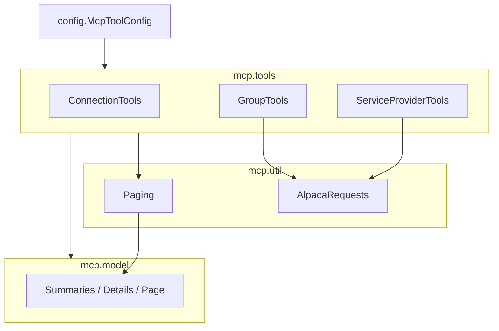

# Requirements

### Overview & Goals
The package `co.pitayagroup.mcp.broadworks.mcp.tools` currently mixes three unrelated kinds of classes:

- **MCP tool beans** (`@Component` classes with `@Tool` methods): `ConnectionTools`, `GroupTools`, `ServiceProviderTools`
- **Data models / DTOs** (records): `ConnectionSummary`, `GroupSummary`, `GroupDetail`, `ServiceProviderSummary`, `ServiceProviderDetail`, `Page`
- **Utility / infrastructure**: `Paging` (pagination + cursor helpers), plus shared static helpers (`ensureSuccess`, `searchMode`) that currently live *inside* `ServiceProviderTools`

The goal is to reorganize these classes **by type** into dedicated packages so responsibilities are obvious, models/utilities are reusable, and tools no longer depend on each other's internals.

### Scope

**In Scope**
- Introduce type-based packages as siblings under `...mcp`: `mcp.model`, `mcp.util`, keeping `mcp.tools`.
- Move the six DTO records into `mcp.model`.
- Move `Paging` into `mcp.util` and extract the shared `ensureSuccess` / `searchMode` helpers out of `ServiceProviderTools` into a new util class in `mcp.util`.
- Adjust visibility (package-private → public) where cross-package access now requires it.
- Update all imports/call-sites in the three tool classes and relocate/adjust the affected tests so the project compiles and all tests pass.

**Out of Scope**
- No behavioral changes to any tool, model, or pagination logic.
- No renaming of public MCP tool names (`broadworks_*`) or of the tool bean classes.
- No changes to unrelated packages (`auth`, `config` beyond imports, top-level `mcp` infra classes).

### User Stories
- As a developer, I want models, tools, and utilities in separate packages so I can find and reuse them without wading through mixed concerns.
- As a maintainer, I want shared helpers (response validation, search-mode parsing, pagination) in a `util` package so a new tool set (Users, Devices, CDRs) can reuse them without depending on `ServiceProviderTools`.

### Functional Requirements
- The application starts and registers the same three tool beans via `McpToolConfig` (unchanged bean wiring).
- All existing MCP tools expose identical names, parameters, descriptions, and return shapes.
- The full Maven build compiles and the existing test suite passes unchanged in behavior.

### Non-Functional Requirements
- **Naming**: singular package names — `model` and `util`.
- **Compatibility**: purely internal refactor; no public MCP contract changes.
- **Decoupling**: after the change, `GroupTools` no longer references `ServiceProviderTools`.

# Technical Design

### Current Implementation
All ten classes live flat in `src/main/java/co/pitayagroup/mcp/broadworks/mcp/tools/`:

- Tools: `ConnectionTools`, `GroupTools`, `ServiceProviderTools` (registered in `config/McpToolConfig.java`).
- Records: `ConnectionSummary`, `GroupSummary`, `GroupDetail`, `ServiceProviderSummary`, `ServiceProviderDetail`, `Page`.
- Helper: `Paging` (package-private `final class`).

Several cross-references currently rely on **package-private** visibility, which the reorg must address:

- `Paging` (and its methods/constants `MAX_PAGE_LIMIT`, `DEFAULT_PAGE_LIMIT`, `effectivePageLimit`, `toPage`, `encodeCursor`, `decodeCursor`) is used by all three tools and by `PagingTest`.
- `ConnectionSummary.from(AlpacaResource)` is a package-private static factory used by `ConnectionTools`.
- `ServiceProviderTools.ensureSuccess(Response, String)` and `ServiceProviderTools.searchMode(String)` are package-private statics used by `GroupTools` — tool-to-tool coupling.
- `GroupTools.toPage` / `GROUP_SCHEMA` and `ServiceProviderTools.toPage` / `SERVICE_PROVIDER_SCHEMA` are package-private and used only by their own class and by tests in the same package.

External references outside `mcp.tools`: only `config/McpToolConfig.java` and the test `config/NonWebContextStartupTest.java`, both of which reference only the three **tool** classes (which stay in `mcp.tools`) — so they need no changes.

### Key Decisions
- **Layout: sibling packages under `mcp`** — `mcp.tools`, `mcp.model`, `mcp.util` (confirmed with user). Aligns models/utils with existing `mcp`-level infra (`AlpacaConnectionFactory`, `HostAllowlist`).
- **Naming: singular** — `model`, `util` (confirmed).
- **Extract shared helpers** — move `ensureSuccess` and `searchMode` out of `ServiceProviderTools` into a new `mcp.util` class so tools stop depending on each other (confirmed).
- **Tools stay in `mcp.tools`** — no need to touch `McpToolConfig` / `NonWebContextStartupTest`. Their private `toPage`/schema helpers and same-package tests keep package-private visibility.

### Proposed Changes

**1. New package `mcp.model`** — move the six records unchanged, except:
- `ConnectionSummary.from(AlpacaResource)` becomes `public static` (called from `mcp.tools`).
- `Page` is already `public` — just relocates.

**2. New package `mcp.util`**:
- Move `Paging` here and widen it to `public final class` with `public static` methods and `public` constants (referenced from tool `@Tool` description strings and tests across packages).
- Add new `AlpacaRequests` util class holding the extracted `public static void ensureSuccess(Response, String)` and `public static SearchMode searchMode(String)` (moved verbatim from `ServiceProviderTools`).

**3. Rewire tools in `mcp.tools`**:
- `ServiceProviderTools`: delete its `ensureSuccess`/`searchMode` definitions; call `AlpacaRequests.ensureSuccess` / `AlpacaRequests.searchMode`; import `Page`, `ServiceProviderSummary`, `ServiceProviderDetail` from `mcp.model` and `Paging` from `mcp.util`.
- `GroupTools`: replace `ServiceProviderTools.searchMode`/`ensureSuccess` calls with `AlpacaRequests.*`; import model records + `Paging` from their new packages.
- `ConnectionTools`: import `ConnectionSummary` from `mcp.model`.

**4. Tests**:
- Relocate `PagingTest` to the `mcp.util` package (it exercises `Paging` + `Page` + `AlpacaException`); update its references to the now-public API.
- `GroupToolsTest`, `ServiceProviderToolsTest`, `ConnectionToolsTest`, `ToolRegistrationProbeTest` stay in `mcp.tools`; add imports for the relocated model records and `Paging`. Their use of package-private `GroupTools.toPage` / schemas remains valid (same package).

### Data Models / Contracts
New util class signature (behavior identical to the current private methods):
```java
package co.pitayagroup.mcp.broadworks.mcp.util;

public final class AlpacaRequests {
    private AlpacaRequests() {}
    public static void ensureSuccess(Response response, String action) { /* moved as-is */ }
    public static SearchMode searchMode(String mode) { /* moved as-is */ }
}
```
`Paging` becomes public with the same method set; no signature/behavior change.

### File Structure
```
src/main/java/co/pitayagroup/mcp/broadworks/mcp/
  tools/
    ConnectionTools.java          (modified: imports)
    GroupTools.java               (modified: imports + AlpacaRequests calls)
    ServiceProviderTools.java     (modified: imports, helpers removed, AlpacaRequests calls)
  model/                          (new)
    ConnectionSummary.java        (moved; from() -> public)
    GroupSummary.java             (moved)
    GroupDetail.java              (moved)
    ServiceProviderSummary.java   (moved)
    ServiceProviderDetail.java    (moved)
    Page.java                     (moved)
  util/                           (new)
    Paging.java                   (moved; widened to public)
    AlpacaRequests.java           (new; extracted helpers)

src/test/java/.../mcp/
  util/PagingTest.java            (moved from tools/)
  tools/GroupToolsTest.java       (modified: imports)
  tools/ServiceProviderToolsTest.java (modified: imports)
  tools/ConnectionToolsTest.java  (modified: imports if needed)
  tools/ToolRegistrationProbeTest.java (modified: imports if needed)
```

### Architecture Diagram


### Risks
- **Visibility misses**: any package-private member accessed across the new boundary must be widened; mitigated by compiling after rewiring (Stage 3).
- **Test package moves**: `PagingTest` must move packages to keep accessing `Paging`; same-package tool tests must gain model/util imports.
- **Import churn only**: no logic changes, so risk of behavioral regression is minimal and caught by the existing suite.

# Testing

### Validation Approach
This is a structural refactor with no intended behavior change, so success = the project compiles and the existing test suite passes with equivalent coverage after relocation.

### Key Scenarios
- Full build compiles: `mvn -q compile test-compile`.
- Existing suite passes: `mvn -q test`.
- `PagingTest` (relocated to `mcp.util`) still validates page limits, cell budget, cursor round-trip, and columnar page building against the now-public `Paging` API.
- `GroupToolsTest` / `ServiceProviderToolsTest` still validate list/get mapping, search-mode handling (`Invalid searchMode` still surfaces through the tool after extraction), and pagination via the same-package `toPage` helpers.
- `NonWebContextStartupTest` and `ToolRegistrationProbeTest` still confirm the three tool beans register and MCP tools are exposed.

### Edge Cases
- Invalid search mode still throws `AlpacaException` with `Invalid searchMode` message via `AlpacaRequests.searchMode`.
- Error responses still throw via `AlpacaRequests.ensureSuccess` with the original message format.
- Invalid/blank pagination cursor behavior unchanged.

### Test Changes
- Move `PagingTest` from `mcp.tools` to `mcp.util`.
- Add imports for relocated `mcp.model` records and `mcp.util.Paging` in the tool tests.
- No new assertions required; behavior is preserved.

# Delivery Steps

### ✓ Step 1: Create mcp.model package and relocate DTO records
The six DTO records live in a dedicated `mcp.model` package and are usable from `mcp.tools`.

- Create package `co.pitayagroup.mcp.broadworks.mcp.model`.
- Move `ConnectionSummary`, `GroupSummary`, `GroupDetail`, `ServiceProviderSummary`, `ServiceProviderDetail`, and `Page` into it (update their `package` declarations).
- Widen `ConnectionSummary.from(AlpacaResource)` from package-private to `public static` so `ConnectionTools` can call it across packages.
- Leave record fields, javadoc, and behavior otherwise unchanged.

### ✓ Step 2: Create mcp.util package: relocate Paging and extract shared helpers
Pagination and shared request helpers live in a dedicated `mcp.util` package, decoupled from any tool class.

- Create package `co.pitayagroup.mcp.broadworks.mcp.util`.
- Move `Paging` into it and widen the class, its constants (`DEFAULT_PAGE_LIMIT`, `MAX_PAGE_LIMIT`, `MAX_CELL_BUDGET`), and its methods (`effectivePageLimit`, `toPage`, `encodeCursor`, `decodeCursor`) to `public` so tools and tests can use them across packages; import `Page` from `mcp.model`.
- Add a new `public final class AlpacaRequests` and move `ensureSuccess(Response, String)` and `searchMode(String)` verbatim from `ServiceProviderTools` into it as `public static` methods (with a private constructor).

### ✓ Step 3: Rewire tool classes and tests to the new package structure
The three tool classes and all tests compile and pass against the new `model`/`util` packages, with no tool-to-tool coupling.

- Update `ServiceProviderTools`: remove its `ensureSuccess`/`searchMode` definitions, call `AlpacaRequests.*` instead, and add imports for `mcp.model` records and `mcp.util.Paging`.
- Update `GroupTools`: replace `ServiceProviderTools.searchMode`/`ensureSuccess` calls with `AlpacaRequests.*`; add imports for the relocated records and `Paging`.
- Update `ConnectionTools`: import `ConnectionSummary` from `mcp.model`.
- Move `PagingTest` to the `mcp.util` package and adjust its references; add `mcp.model`/`mcp.util` imports to `GroupToolsTest`, `ServiceProviderToolsTest`, `ConnectionToolsTest`, and `ToolRegistrationProbeTest` as needed.
- Verify with `mvn -q test` that the full build compiles and the suite passes (confirming `McpToolConfig` and `NonWebContextStartupTest` are unaffected).).